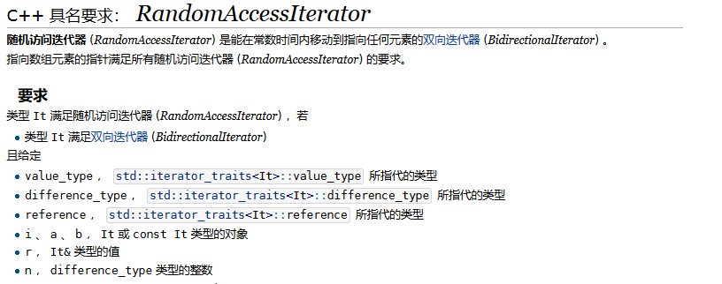
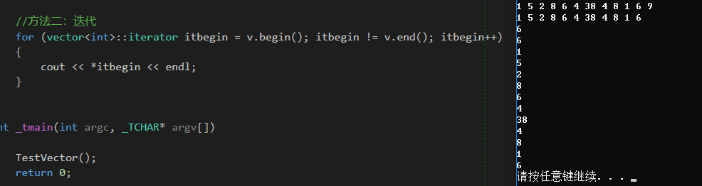
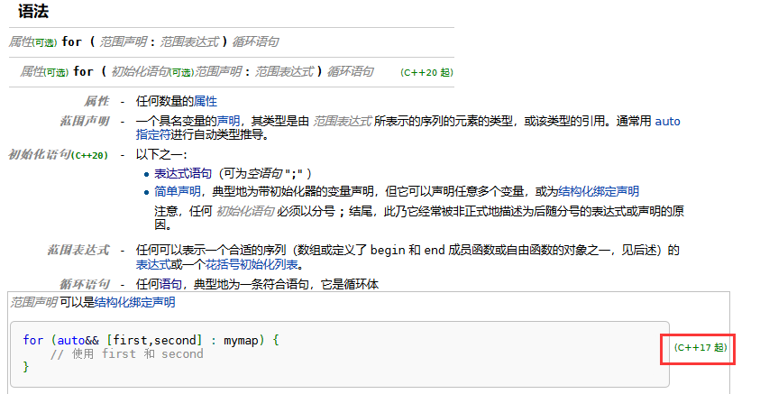
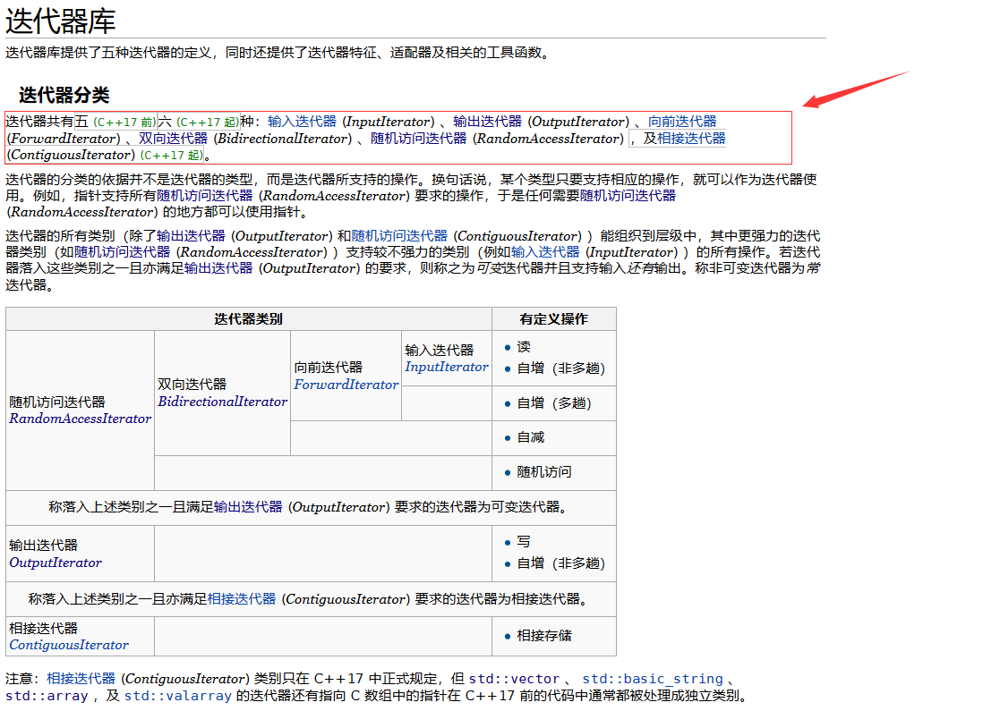

#### 动态相邻数组 vector
>1.基本概念

>2.访问方式

>3.成员函数介绍

>4.迭代器

>time:18.12.16

***

* 1 基本概念
  + std::vector 是封装动态数组的顺序容器
    std::pmr::vector 是使用多态分配器的模板别名(暂不讨论)

  + 因为是元素相继存储，所以不仅可以用迭代器，还能用指向元素的常规指针访问元素。
    

  + 成员类型，主要学习下iterator
    

    - 简单介绍
      
***

* 2 访问方式
  + 下标访问

  ```c++
  for (size_t nCount = 0; nCount < v.size(); nCount++)
  {
    cout << v[nCount] << " ";
  }
  ```
    

  + 迭代器

    ```c++
    for (vector<int>::iterator itbegin = v.begin(); itbegin != v.end(); itbegin++)
    {
        cout << *itbegin << endl;
    }
    ```
      

  + 回调函数
    - 头文件:algorithm
    

    ```c++
    cout << "myvector contains:" << endl;
    auto print = [](const int& n){ std::cout << " " << n; };
    for_each(v.begin(), v.end(), print);
    ```
    

  + 基于范围的for循环
    - 在范围上执行for循环
    - 语法
      

    -语法的解释
     ```c++
     //c++17前
     {
         auto && __range = 范围表达式;
         for (auto __begin = 首表达式, __end = 尾表达式; __begin != __end; ++__begin)
         {
             范围声明 = *__begin;
             循环语句
         }
     }
     ```

     ```c++
     //c++17后
     {
         初始化语句
         auto && __range = 范围表达式;
         auto __begin = 首表达式;
         auto __end = 尾表达式;
         for(; __begin != __end; ++__begin)
         {
             范围声明 = *__begin;
             循环语句
         }
     }
     ```

     ```c++
     for (int i : v)
    {
    cout << i << " ";
    }
     ```

     
***

* 3 成员函数介绍

  + std::vector::size()
  

    - 实际就是指向容器末元素后一元素的迭代器 - 指向容器首元素的迭代器
  

  + std::vector::back()
    - 返回到容器中最后一个元素的引用
    - 在空容器中对back()的调用是未定义的
    

    - 对于容器c

          return c.back();<==>{auto tmp = c.end(); --tmp; return *tmp}
      

    ```c++
    vector<int>::iterator p = v.end();
    cout << v.back() << endl;
    cout << *(--p) << endl;
    ```

  + std::vector::end, std::vector::begin
    - 返回值：指向后随最后元素的迭代器
    

***

* 4 迭代器
  + 迭代器的分类依据并不是迭代器的类型，而是迭代器所支持的操作。换句话说，某个类型只要支持相应的操作，就可以作为迭代器使用
    - 例如：指针支持所有随机访问迭代器操作的要求，于是任何需要随机访问迭代器的地方都可以使用指针
    
