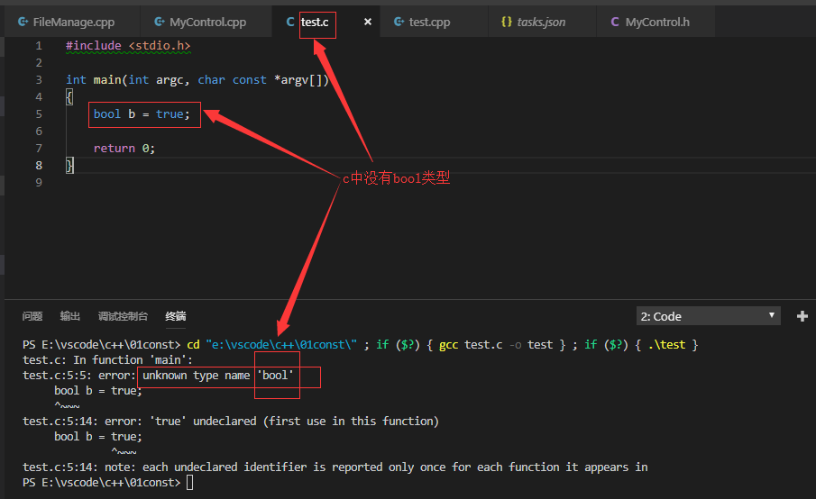
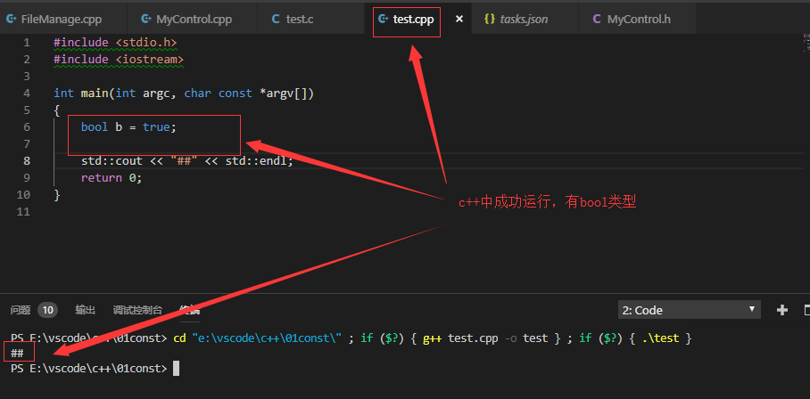
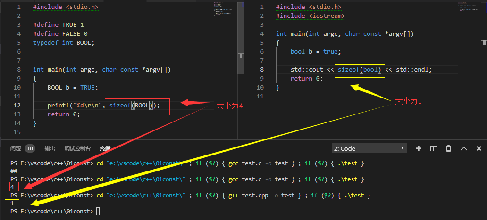
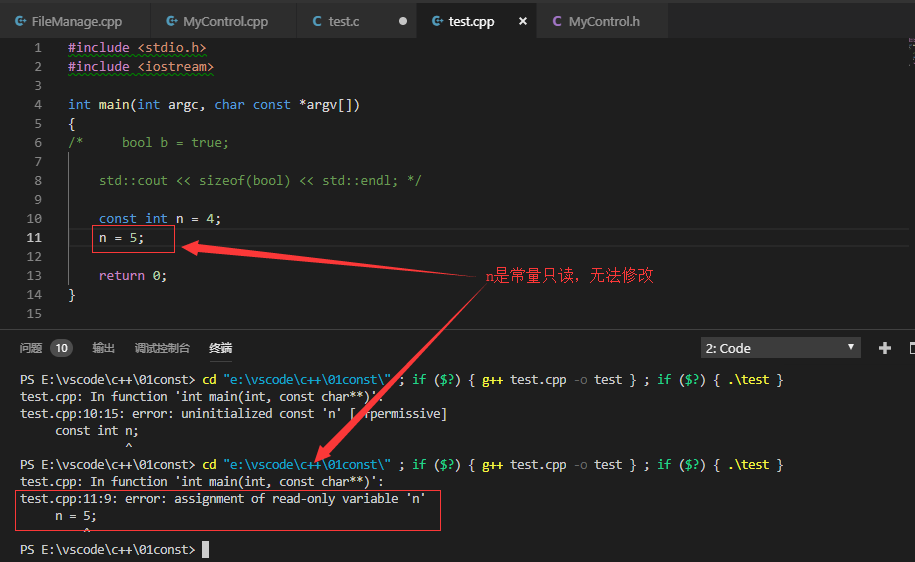
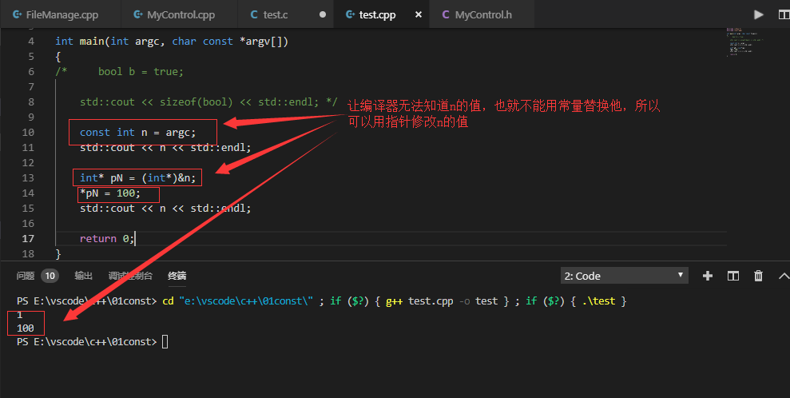
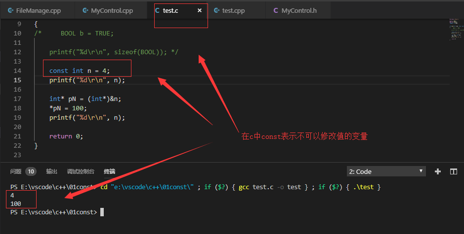

#### 介绍bool类型，以及const关键字在c,c++中的区别
> 1.bool 类型
> 2.const
>time：2018.11.20

***

* 1 bool类型

  +  在c中
     - 没有bool类型
     

  +  在c++中
     - 有bool类型
     

  + 在c中实现BOOL，并观察与c++中的区别
    - 区别仅仅在占用的大小方面
    

***

* 2 const关键字
  + const常量必须赋初值
  

  + const常量值定义后不能改变
  

  + 通过指针可以修改const常量的值，得让编译器不知道常量的值
  

  + const在C语言中的表示是不可以修改值的变量
  
 ***
