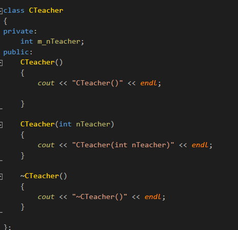

#### 介绍New,Delete运算符，初始化列表
> 1.New,Delete运算符
> 2.初始化列表
>time：2018.11.28

***

* 1 New,Delete运算符

  + 对于基本数据类型, new[]可以使用delete[], delete, free来释放空间，效果一样。
  + 对于类对象的数组，new[]只能使用delete[]来释放。
    - new[]对象数组，该对象数组应该提供一个无参构造
    - new[]对象数组， 会利用分配空间头部4个字节记录对象数组的个数，可用于delete[]释放时，调用析构的次数。
    
***

* 2 初始化列表
  + 在构造函数的函数名后面添加：,添加的成员变量名(初始化的值)：

  + const成员变量通常是在初始化列表中赋值，高版本VS也可以在申明处赋值。

  + 初始化列表在构造函数前被调用赋值
  + 可以通过初始化列表来初始化类成员对象(调用类成员对象指定的构造函数)

 ***
