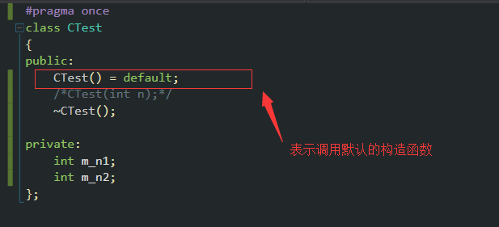
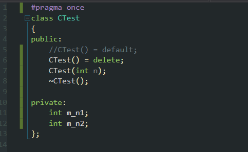
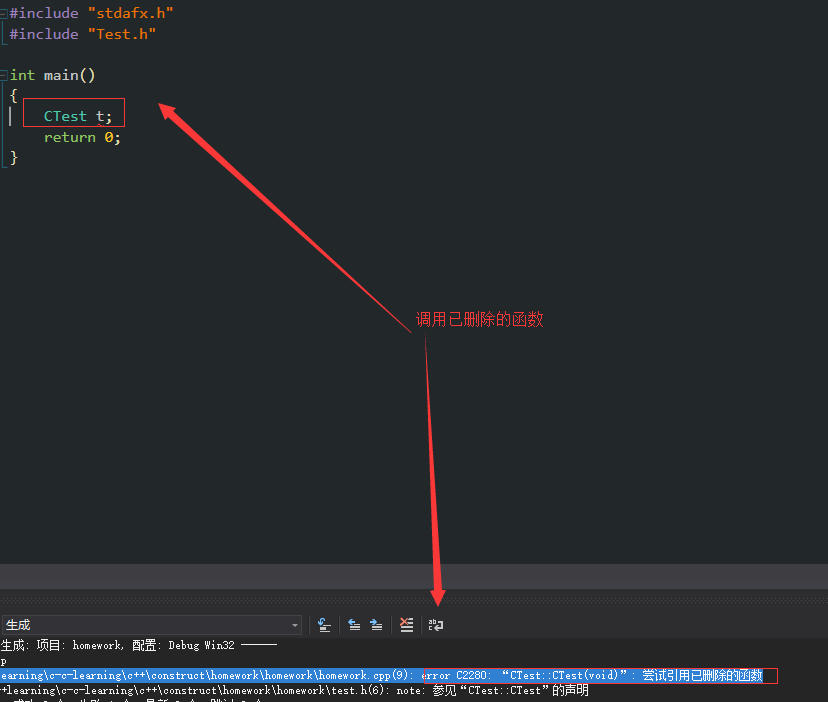
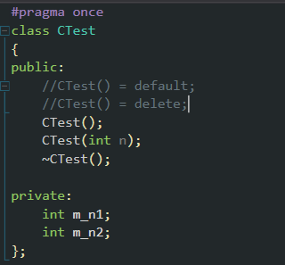
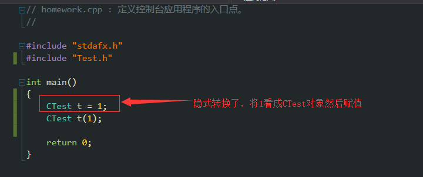
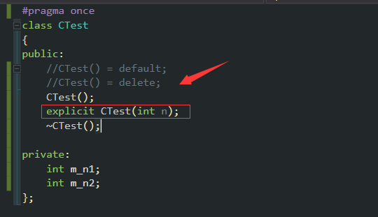
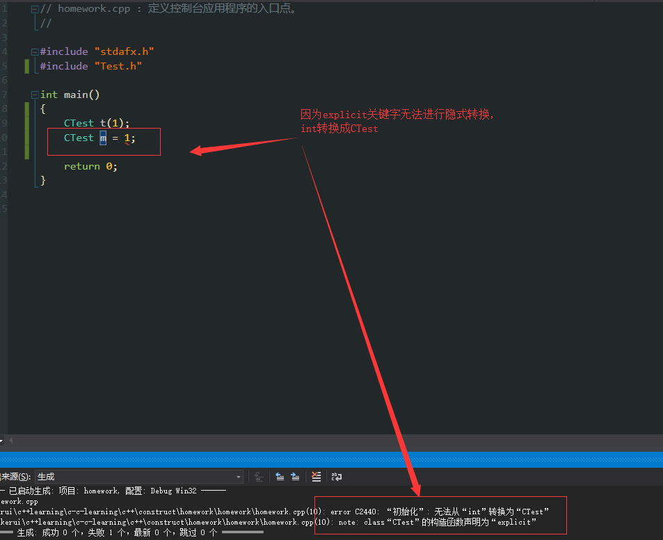

#### 关键字default,delete,explicit在类中的作用
> 1.default
> 2.delete
> 3.explicit
>time：2018.11.28
***

* 1 default

  + 表示使用编译器提供的默认构造函数
    

***

* 2 delete

  + 表示禁止使用某参数
    
    

***

* 3 explicit

  + 表示只支持显示调用构造函数，不允许隐式转换
    - 当构造有一个参数时，创建对象时有下面两种写法：
    
    

    - 当加入explicit后，禁止隐式转换
    
    
