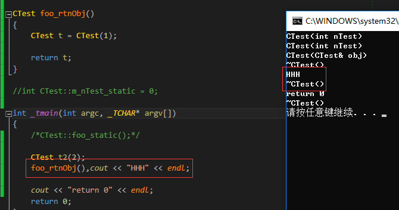
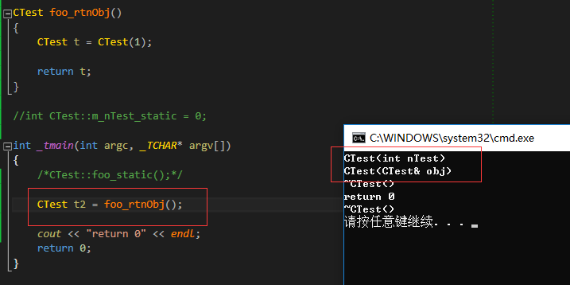
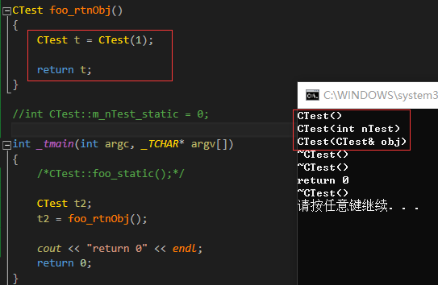

#### 对象构造和析构的时机
> 1.全局对象
> 2.栈对象
> 3.堆对象
> 4.类对象成员
>time：2018.11.28
***

* 1 全局对象
  + 构造函数：main()之前
  + 析构函数：main()之后

***

* 2 栈对象
  + 块作用域：

  ***

  + 参数：

  ****

  + 返回值：
    - 说明
      >无名对象：没有名字的对象。
      >当类的对象作为返回值时，会返回一个无名对象。
      >该无名对象一般是通过拷贝构造函数构造的。

    - 构造时机：
      >return时构造。

    - 析构时机：

          1). foo_rtnObj(); ->以该函数末尾的;作为析构时机。

      

          2). CTest t2 = foo_rtnObj(); 存在一次优化，返回的对象直接拷贝给了t2，优
          化了中间的无名对象。此时析构的时机是t2的生命周期结束。

      

          3). CTest t2; t2 = foo_rtnObj();返回的无名对象通过=运算符重载给t2赋值。

      

      - 代码

    ```c++
    #include "stdafx.h"
    #include <iostream>
    #include <stdio.h>
    using namespace std;

    class CTest
    {
    public:
        /*static int m_nTest_static;*/
        CTest()
        {
            cout << "CTest()" << endl;
        }

        CTest(int nTest)
        {
            m_nTest = nTest;
            cout << "CTest(int nTest)" << endl;
        }

        CTest(CTest& obj)
        {
            m_nTest = obj.m_nTest;
            cout << "CTest(CTest& obj)" << endl;
        }

        ~CTest()
        {
            cout << "~CTest()" << endl;
        }

        void foo()
        {
            cout << "void foo()" << endl;
        }

    private:
        int m_nTest = 1;
    };

    CTest foo_rtnObj()
    {
        CTest t = CTest(1);

        cout << "lala" << endl;
        return t;
    }

    int _tmain(int argc, _TCHAR* argv[])
    {
        CTest t2 = foo_rtnObj();

        cout << "return 0" << endl;
    	return 0;
    }
    ```
***

* 3 堆对象

      使用new(运算符)来构造对象:
      > 分配空间 -- (对应malloc)
      > 调用对应的构造函数

      使用delete(运算符)来析构对象:
      > 调用析构函数
      > 释放空间 -- (对应free)

***

* 4 类对象成员
   + 组合类的构造顺序：

         先朋友(成员类对象),再自己。
   + 析构顺序

         先自己，再朋友(成员类对象)。
